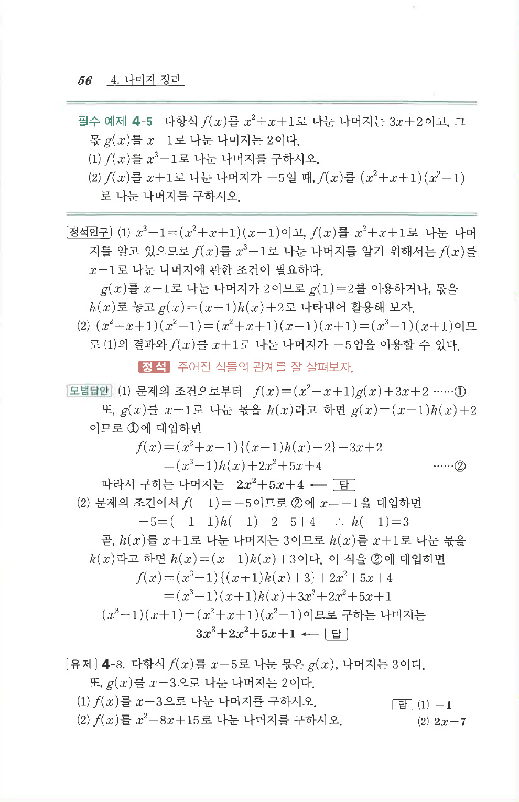

# 유제 4-8

## 문제

다항식 $f(x)$를 $x-5$로 나눈 몫은 $g(x)$, 나머지는 $3$이다. 또, $g(x)$를 $x-3$으로 나눈 나머지는 $2$이다.

1. $f(x)$를 $x-3$으로 나눈 나머지를 구하시오.
2. $f(x)$를 $x^2-8x+15$로 나눈 나머지를 구하시오.

## 정답

1. $$-1$$
2. $$2x-7$$

## 원문

