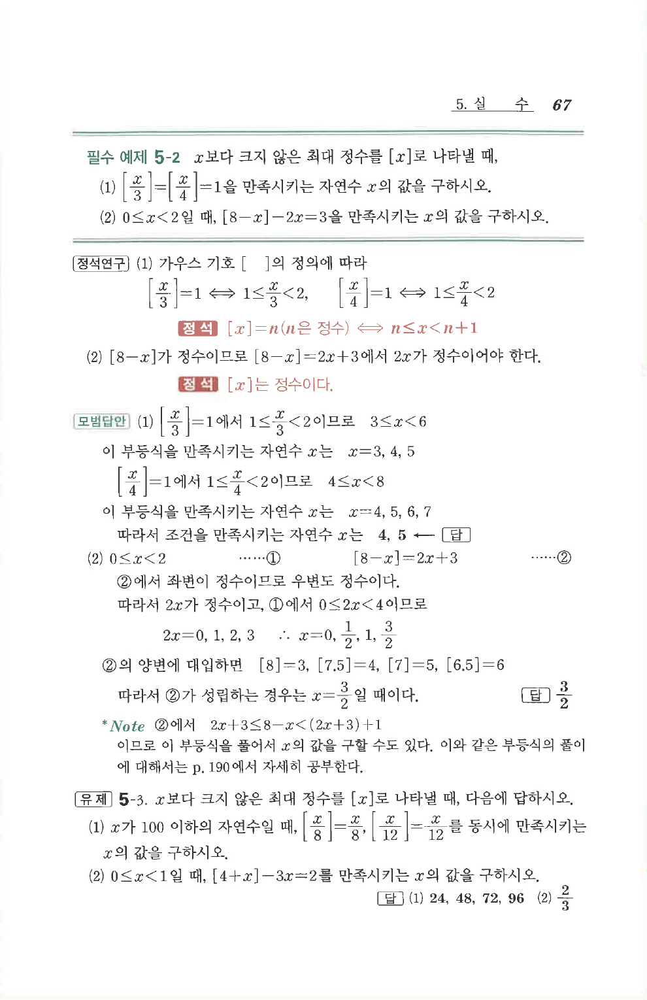

# 유제 5-3

## 문제

$x$보다 크지 않은 최대 정수를 $[x]$로 나타낼 때, 다음에 답하시오.

1. $x$가 $100$ 이하의 자연수일 때, $\left[\frac{x}{8}\right]=\frac{x}{8}$, $\left[\frac{x}{12}\right]=\frac{x}{12}$를 동시에 만족시키는 $x$의 값을 구하시오.
2. $0\le x<1$일 때, $[4+x]-3x=2$를 만족시키는 $x$의 값을 구하시오.

## 정답

1. $$24,\ 48,\ 72,\ 96$$
2. $$\frac23$$

## 원문

