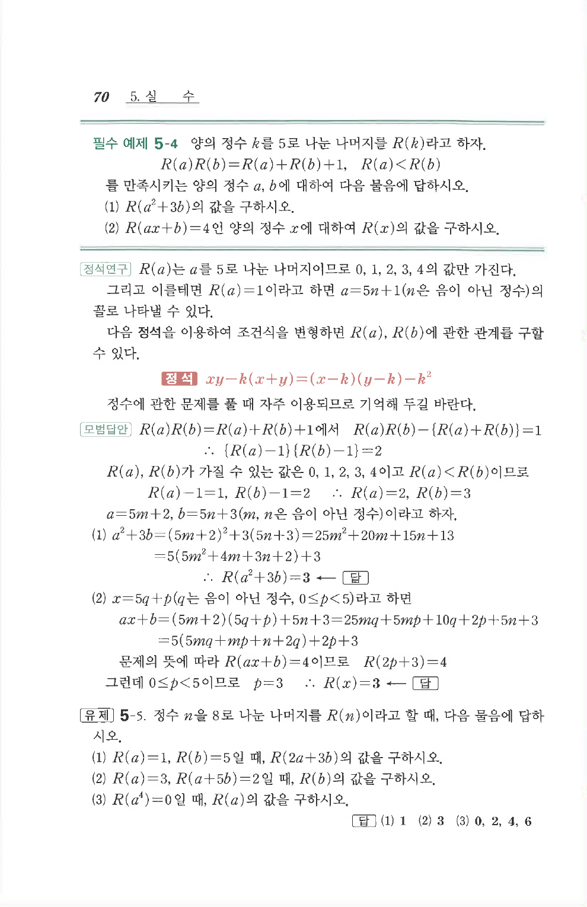

# 유제 5-5

## 문제

정수 $n$을 $8$로 나눈 나머지를 $R(n)$이라고 할 때, 다음 물음에 답하시오.

1. $R(a)=1$, $R(b)=5$일 때, $R(2a+3b)$의 값을 구하시오.
2. $R(a)=3$, $R(a+5b)=2$일 때, $R(b)$의 값을 구하시오.
3. $R(a^4)=0$일 때, $R(a)$의 값을 구하시오.

## 정답

1. $$1$$
2. $$3$$
3. $$0,\ 2,\ 4,\ 6$$

## 원문

