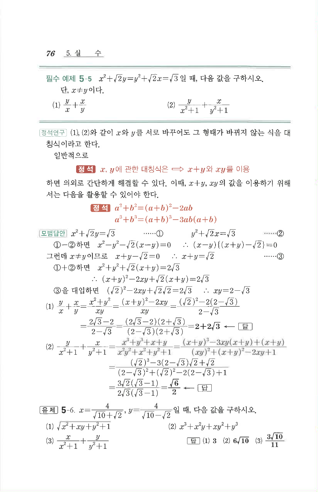

# 유제 5-6

## 문제

$x=\dfrac{4}{\sqrt{10}+\sqrt2}$, $y=\dfrac{4}{\sqrt{10}-\sqrt2}$일 때, 다음 값을 구하시오.

1. $$\sqrt{x^2+xy+y^2+1}$$
2. $$x^3+x^2y+xy^2+y^3$$
3. $$\frac{x}{x^2+1}+\frac{y}{y^2+1}$$

## 정답

1. $$3$$
2. $$6\sqrt{10}$$
3. $$\frac{3\sqrt{10}}{11}$$

## 원문

