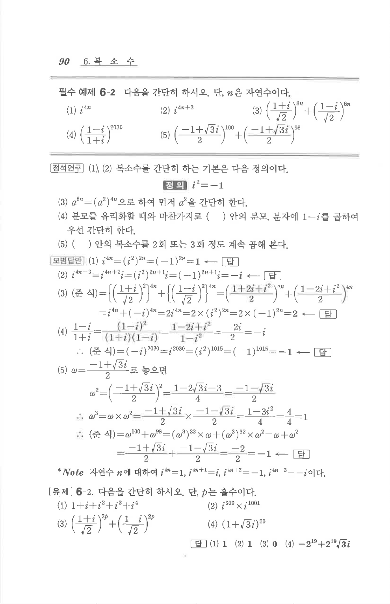

# 유제 6-2

## 문제

다음을 간단히 하시오. 단, $p$는 홀수이다.

1. $1+i+i^2+i^3+i^4$
2. $i^{999}\times i^{1001}$
3. $\left(\dfrac{1+i}{\sqrt2}\right)^{2p}+\left(\dfrac{1-i}{\sqrt2}\right)^{2p}$
4. $(1+\sqrt3 i)^{20}$

## 정답

1. $1$
2. $1$
3. $0$
4. $-2^{19}+2^{19}\sqrt3 i$

## 원문 문제

## 원문

