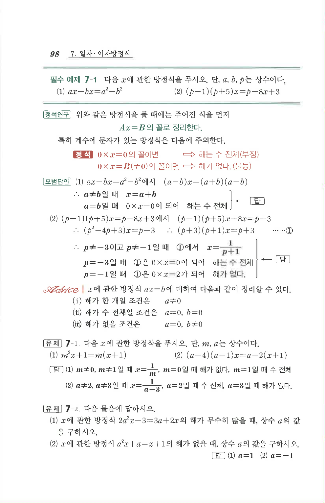

# 유제 7-1

## 문제

다음 $x$에 관한 방정식을 푸시오. 단, $m,a$는 상수이다.

1. $m^2x+1=m(x+1)$
2. $(a-4)(a-1)x=a-2(x+1)$

## 정답

1. $m\ne0,1$일 때 $x=\dfrac1m$, $m=0$일 때 해가 없다, $m=1$일 때 해는 수 전체
2. $a\ne2,3$일 때 $x=\dfrac1{a-3}$, $a=2$일 때 해는 수 전체, $a=3$일 때 해가 없다.

## 원문 문제

## 원문

