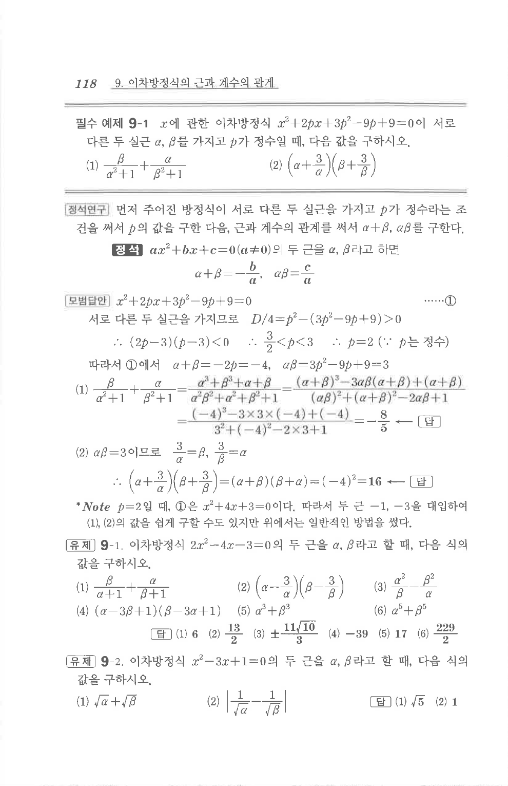

# 유제 9-1

## 문제

이차방정식 $2x^2-4x-3=0$의 두 근을 $\alpha, \beta$라고 할 때, 다음 식의 값을 구하시오.

1. $\dfrac{\beta}{\alpha+1}+\dfrac{\alpha}{\beta+1}$
2. $\left(\alpha-\dfrac3\alpha\right)\left(\beta-\dfrac3\beta\right)$
3. $\dfrac{\alpha^2}{\beta}-\dfrac{\beta^2}{\alpha}$
4. $(\alpha-3\beta+1)(\beta-3\alpha+1)$
5. $\alpha^3+\beta^3$
6. $\alpha^5+\beta^5$

## 정답

1. $6$
2. $\dfrac{13}{2}$
3. $\pm\dfrac{11\sqrt{10}}{3}$
4. $-39$
5. $17$
6. $\dfrac{229}{2}$

## 원문 문제

## 원문

