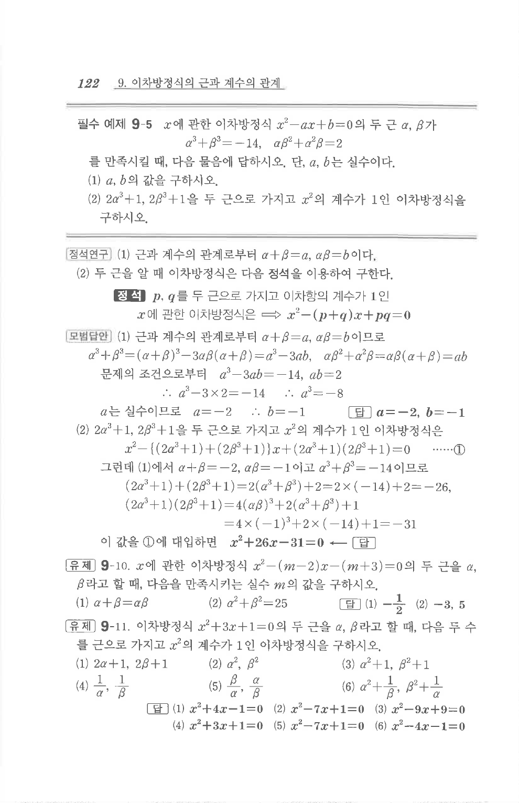

# 유제 9-11

## 문제

이차방정식 $x^2+3x+1=0$의 두 근을 $\alpha, \beta$라고 할 때, 다음 두 수를 근으로 가지고 $x^2$의 계수가 $1$인 이차방정식을 구하시오.

1. $2\alpha+1,\ 2\beta+1$
2. $\alpha^2,\ \beta^2$
3. $\alpha^2+1,\ \beta^2+1$
4. $\dfrac1\alpha,\ \dfrac1\beta$
5. $\dfrac\beta\alpha,\ \dfrac\alpha\beta$
6. $\alpha^2+\dfrac1\beta,\ \beta^2+\dfrac1\alpha$

## 정답

1. $x^2+4x-1=0$
2. $x^2-7x+1=0$
3. $x^2-9x+9=0$
4. $x^2+3x+1=0$
5. $x^2-7x+1=0$
6. $x^2-4x-1=0$

## 원문 문제

## 원문

