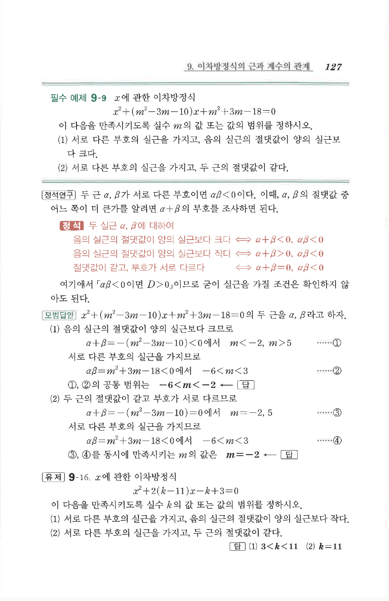

# 유제 9-16

## 문제

$x$에 관한 이차방정식

$$x^2+2(k-11)x-k+3=0$$

이 다음을 만족시키도록 실수 $k$의 값 또는 값의 범위를 정하시오.

1. 서로 다른 부호의 실근을 가지고, 음의 실근의 절댓값이 양의 실근보다 작다.
2. 서로 다른 부호의 실근을 가지고, 두 근의 절댓값이 같다.

## 정답

1. $3<k<11$
2. $k=11$

## 원문 문제

## 원문

