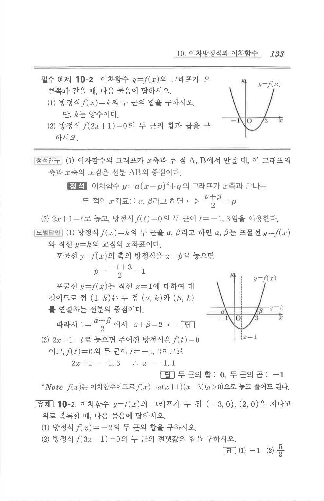

# 유제 10-2

## 문제

이차함수 $y=f(x)$의 그래프가 두 점 $(-3,0), (2,0)$을 지나고 위로 볼록할 때, 다음 물음에 답하시오.

1. 방정식 $f(x)=-2$의 두 근의 합을 구하시오.
2. 방정식 $f(3x-1)=0$의 두 근의 절댓값의 합을 구하시오.

## 정답

1. $-1$
2. $\dfrac53$

## 원문 문제

## 원문

