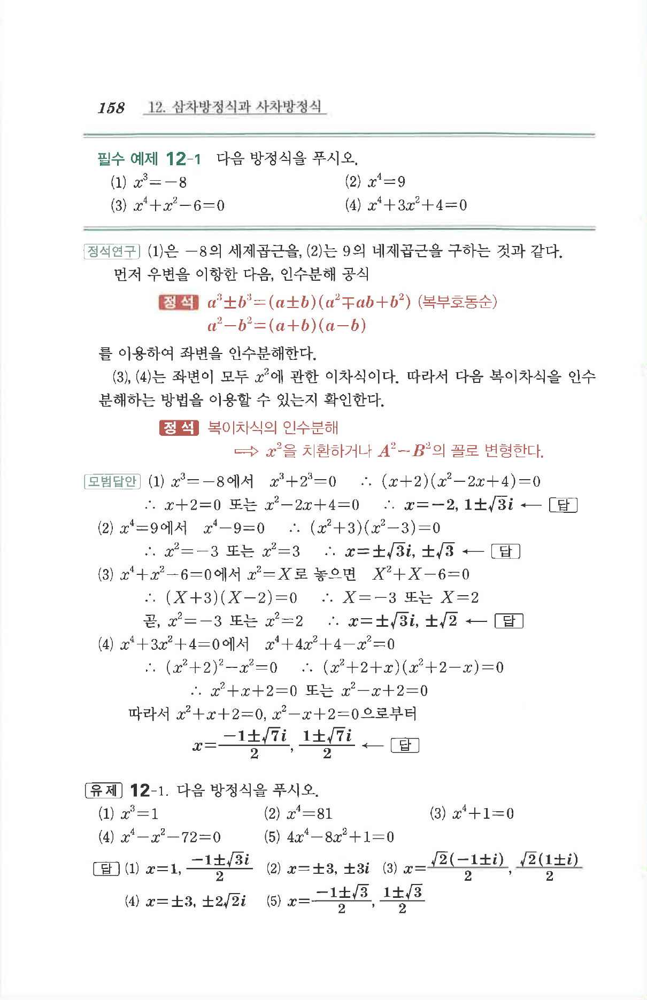

# 유제 12-1

## 문제

다음 방정식을 푸시오.

1. $$x^3=1$$
2. $$x^4=81$$
3. $$x^4+1=0$$
4. $$x^4-x^2-72=0$$
5. $$4x^4-8x^2+1=0$$

## 정답

1. $$x=1,\ \frac{-1\pm\sqrt3 i}{2}$$
2. $$x=\pm3,\ \pm3i$$
3. $$x=\frac{\sqrt2(-1\pm i)}2,\ \frac{\sqrt2(1\pm i)}2$$
4. $$x=\pm3,\ \pm2\sqrt2 i$$
5. $$x=\frac{-1\pm\sqrt3}{2},\ \frac{1\pm\sqrt3}{2}$$

## 원문

