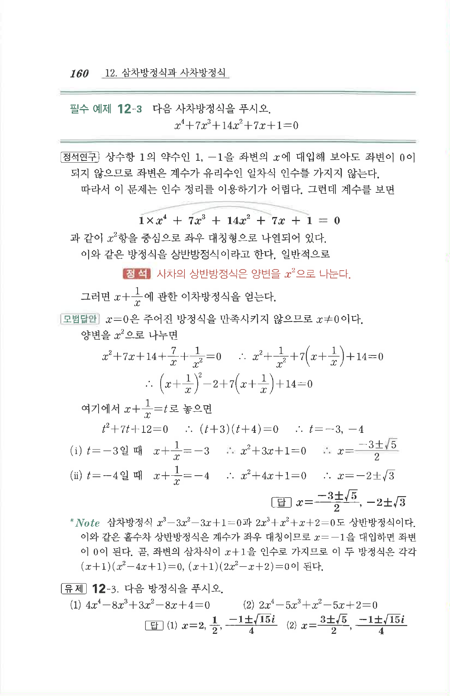

# 유제 12-3

## 문제

다음 방정식을 푸시오.

1. $$4x^4-8x^3+3x^2-8x+4=0$$
2. $$2x^4-5x^3+x^2-5x+2=0$$

## 정답

1. $$x=2,\ \frac12,\ \frac{-1\pm\sqrt{15}i}{4}$$
2. $$x=\frac{3\pm\sqrt5}{2},\ \frac{-1\pm\sqrt{15}i}{4}$$

## 원문

