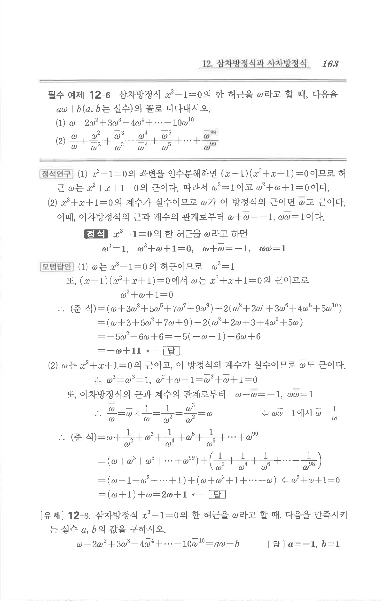

# 유제 12-8

## 문제

삼차방정식 $x^3+1=0$의 한 허근을 $\omega$라고 할 때, 다음을 만족시키는 실수 $a,b$의 값을 구하시오.

$$\omega-2\overline\omega^2+3\omega^3-4\overline\omega^4+\cdots-10\overline\omega^{10}=a\omega+b$$

## 정답

$$a=-1,\quad b=1$$

## 원문

