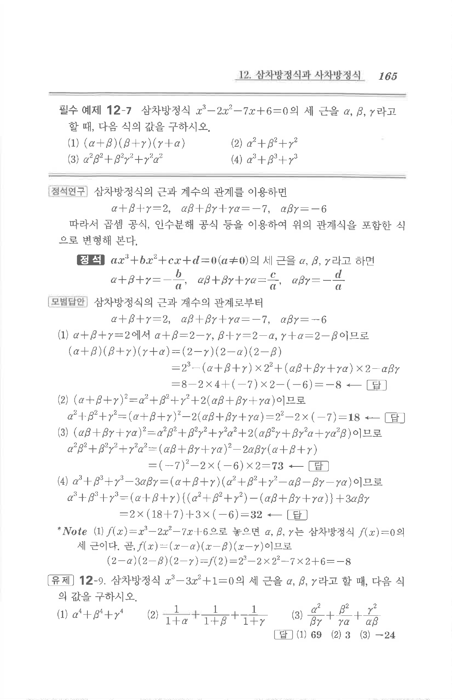

# 유제 12-9

## 문제

삼차방정식

$$x^3-3x^2+1=0$$

의 세 근을 $\alpha,\beta,\gamma$라고 할 때, 다음 식의 값을 구하시오.

1. $$\alpha^4+\beta^4+\gamma^4$$
2. $$\frac1{1+\alpha}+\frac1{1+\beta}+\frac1{1+\gamma}$$
3. $$\frac{\alpha^2}{\beta\gamma}+\frac{\beta^2}{\gamma\alpha}+\frac{\gamma^2}{\alpha\beta}$$

## 정답

1. $$69$$
2. $$3$$
3. $$-24$$

## 원문

