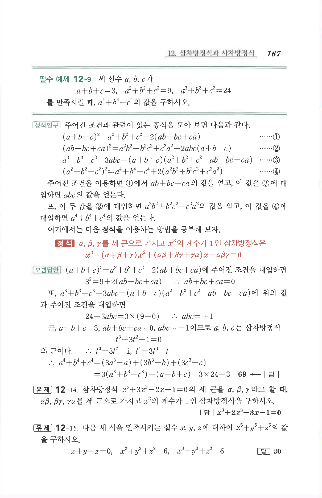

# 유제 12-14

## 문제

삼차방정식

$$x^3+3x^2-2x-1=0$$

의 세 근을 $\alpha,\beta,\gamma$라고 할 때, $\alpha\beta,\beta\gamma,\gamma\alpha$를 세 근으로 가지고 $x^3$의 계수가 $1$인 삼차방정식을 구하시오.

## 정답

$$x^3+2x^2-3x-1=0$$

## 원문

