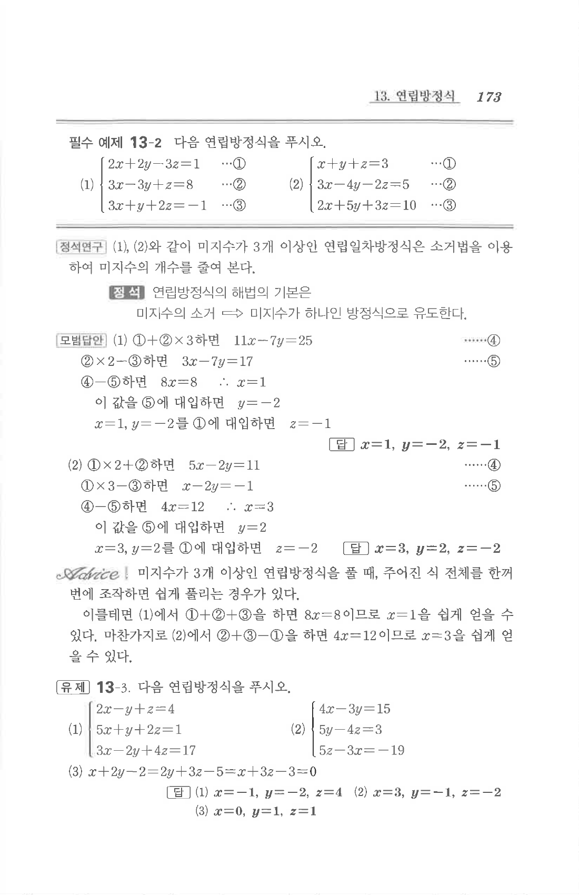

# 유제 13-3

## 문제

다음 연립방정식을 푸시오.

1. $$\begin{cases}2x-y+z=4\\5x+y+2z=1\\3x-2y+4z=17\end{cases}$$
2. $$\begin{cases}4x-3y=15\\5y-4z=3\\5z-3x=-19\end{cases}$$
3. $$x+2y-2=2y+3z-5=x+3z-3=0$$

## 정답

1. $$x=-1,\ y=-2,\ z=4$$
2. $$x=3,\ y=-1,\ z=-2$$
3. $$x=0,\ y=1,\ z=1$$

## 원문

