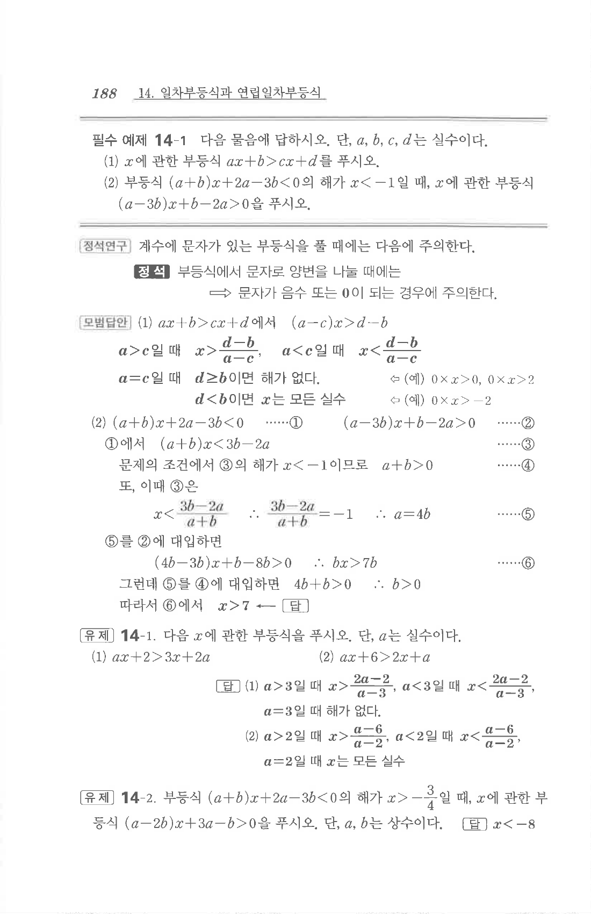

# 유제 14-1

## 문제

다음 $x$에 관한 부등식을 푸시오. 단, $a$는 실수이다.

1. $$ax+2>3x+2a$$
2. $$ax+6>2x+a$$

## 정답

1. $a>3$일 때 $$x>\dfrac{2a-2}{a-3}$$  
   $a<3$일 때 $$x<\dfrac{2a-2}{a-3}$$  
   $a=3$일 때 해가 없다.
2. $a>2$일 때 $$x>\dfrac{a-6}{a-2}$$  
   $a<2$일 때 $$x<\dfrac{a-6}{a-2}$$  
   $a=2$일 때 모든 실수이다.

## 원문

