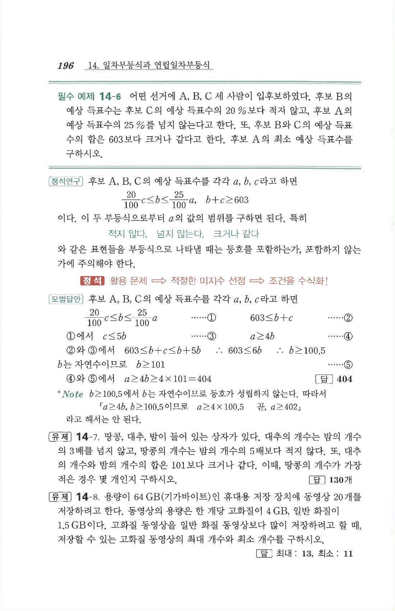

# 유제 14-7

## 문제

땅콩, 대추, 밤이 들어 있는 상자가 있다. 대추의 개수는 밤의 개수의 $3$배를 넘지 않고, 땅콩의 개수는 밤의 개수의 $5$배보다 적지 않다. 또, 대추의 개수와 밤의 개수의 합은 $101$보다 크거나 같다. 이때, 땅콩의 개수가 가장 적은 경우 몇 개인지 구하시오.

## 정답

$$130\text{개}$$

## 원문

