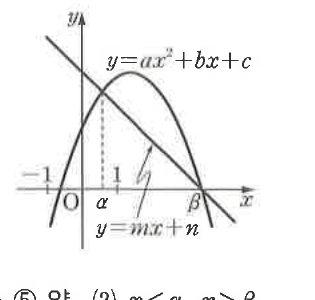
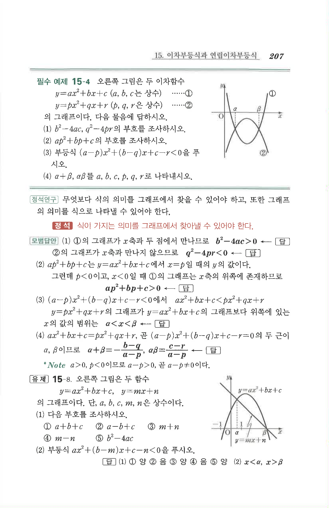

# 유제 15-8

## 문제

오른쪽 그림은 두 함수

$$y=ax^2+bx+c,\qquad y=mx+n$$

의 그래프이다. 단, $a,b,c,m,n$은 상수이다.

1. 다음 부호를 조사하시오.
   1. $a+b+c$
   2. $a-b+c$
   3. $m+n$
   4. $m-n$
   5. $b^2-4ac$
2. 부등식 $$ax^2+(b-m)x+c-n<0$$을 푸시오.

## 정답

1. ① 양, ② 음, ③ 양, ④ 음, ⑤ 양
2. $$x<\alpha,\quad x>\beta$$

## 도형

위로 볼록한 직선이 아니라, 아래로 열린 포물선 $y=ax^2+bx+c$와 감소하는 직선 $y=mx+n$이 그려져 있다. 두 그래프는 $x$좌표가 $\alpha$, $\beta$인 두 점에서 만나며, $x$축 위에는 $-1$, $1$, $\alpha$, $\beta$가 표시되어 있다.

## 원문

