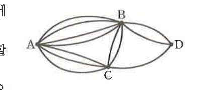

# 유제 16-1

## 문제

A, B, C, D의 네 지점 사이에 오른쪽 그림과 같은 도로망이 있다. 같은 지점은 많아야 한 번 지난다고 할 때, 다음 물음에 답하시오.

1. A에서 D로 가는 경우의 수를 구하시오.
2. A에서 D를 다녀오는 경우의 수를 구하시오.

## 정답

1. $$31$$
2. $$48$$

## 도형

A에서 B, C를 거쳐 D로 갈 수 있는 여러 도로가 그려져 있다. A와 B 사이, A와 C 사이, B와 C 사이, B와 D 사이, C와 D 사이에 각각 여러 개의 길이 있다.

## 원문

