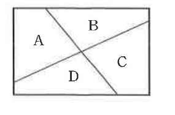

# 유제 16-3

## 문제

오른쪽 그림의 A, B, C, D에 주어진 네 가지 색의 전부 또는 일부를 사용하여 칠하려고 한다. 같은 색을 여러 번 사용해도 좋으나 한 변을 공유하는 부분에는 서로 다른 색을 칠하는 경우의 수를 구하시오.

## 정답

$$84$$

## 도형

직사각형이 네 영역 A, B, C, D로 나뉘어 있다. 내부의 두 선분이 교차하여 네 부분이 만들어지고, 한 변을 공유하는 영역끼리는 서로 다른 색이어야 한다.

## 원문

