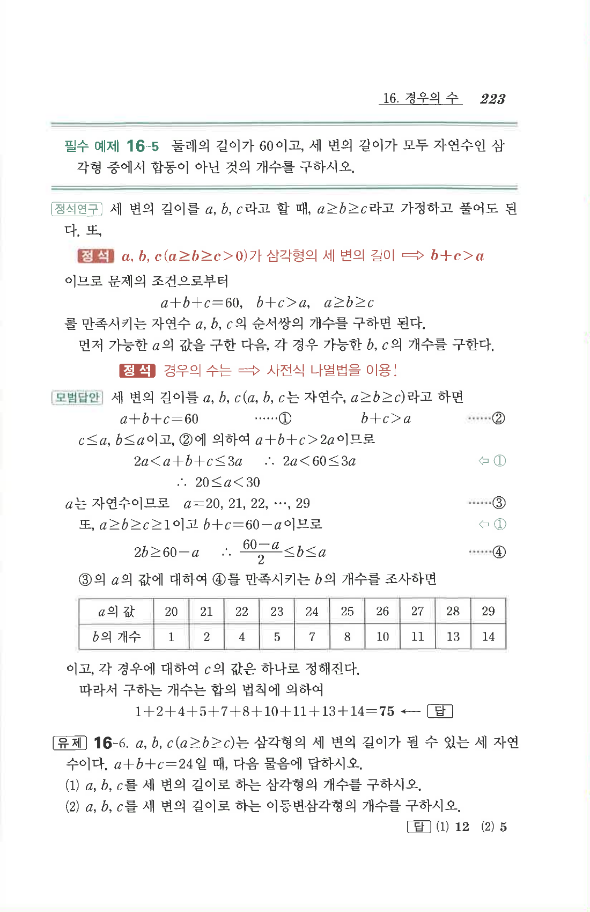

# 유제 16-6

## 문제

$a,b,c$($a\ge b\ge c$)는 삼각형의 세 변의 길이가 될 수 있는 세 자연수이다. $a+b+c=24$일 때, 다음 물음에 답하시오.

1. $a,b,c$를 세 변의 길이로 하는 삼각형의 개수를 구하시오.
2. $a,b,c$를 세 변의 길이로 하는 이등변삼각형의 개수를 구하시오.

## 정답

1. $$12$$
2. $$5$$

## 원문

