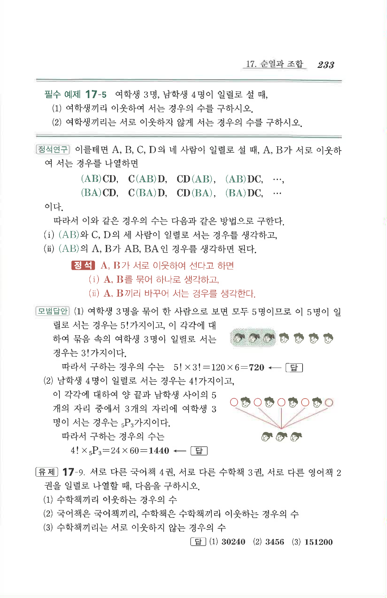

# 유제 17-9

## 문제

서로 다른 국어책 $4$권, 서로 다른 수학책 $3$권, 서로 다른 영어책 $2$권을 일렬로 나열할 때, 다음을 구하시오.

1. 수학책끼리 이웃하는 경우의 수
2. 국어책은 국어책끼리, 수학책은 수학책끼리 이웃하는 경우의 수
3. 수학책끼리는 서로 이웃하지 않는 경우의 수

## 정답

1. $$30240$$
2. $$3456$$
3. $$151200$$

## 원문

