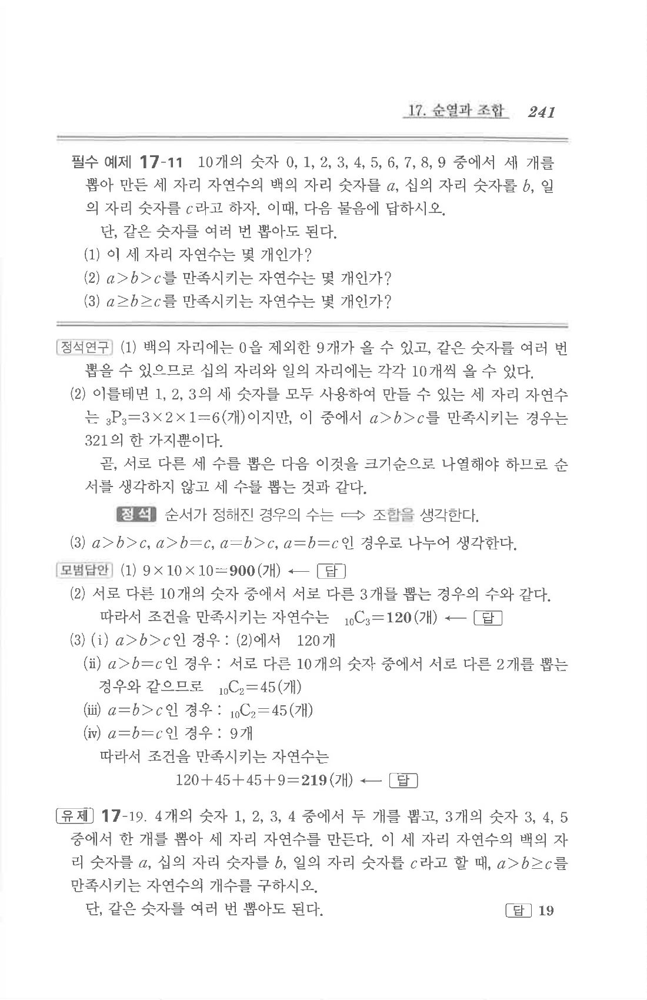

# 유제 17-19

## 문제

$4$개의 숫자 $1,2,3,4$ 중에서 두 개를 뽑고, $3$개의 숫자 $3,4,5$ 중에서 한 개를 뽑아 세 자리 자연수를 만든다. 이 세 자리 자연수의 백의 자리 숫자를 $a$, 십의 자리 숫자를 $b$, 일의 자리 숫자를 $c$라고 할 때, $a>b\ge c$를 만족시키는 자연수의 개수를 구하시오. 단, 같은 숫자를 여러 번 뽑아도 된다.

## 정답

$$19$$

## 원문

