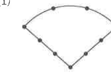
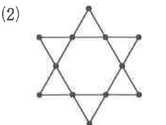
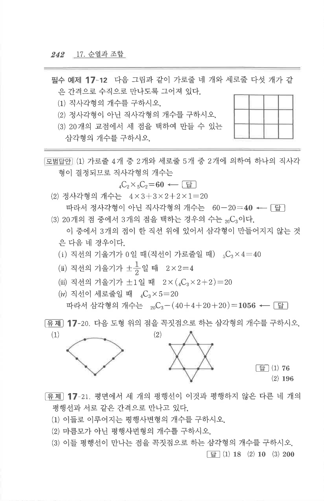

# 유제 17-20

## 문제

다음 도형 위의 점을 꼭짓점으로 하는 삼각형의 개수를 구하시오.

1. 그림 (1)
2. 그림 (2)

## 정답

1. $$76$$
2. $$196$$

## 도형

그림 (1)은 위쪽에 호 모양의 곡선과 아래쪽 V자 선분이 만나는 도형 위에 여러 점이 표시되어 있다. 그림 (2)는 별 모양 도형 위의 점들이 표시되어 있다. 그림 (2)는 아래 원문 이미지와 별도 파일 `figure-17-yuje-20-2.png`도 함께 참고한다.

## 원문

