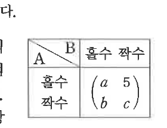

# 유제 18-1

## 문제

두 학생 A, B가 각각 주사위를 한 개씩 던져서 나오는 눈의 수가 둘 다 홀수이면 A가 $10$점을, 둘 다 짝수이면 B가 $10$점을 상대로부터 받는다. 나머지 경우에는 나오는 눈의 수가 홀수인 학생이 상대로부터 $5$점을 받는다. 이 게임의 결과를 오른쪽과 같이 행렬로 나타낼 때, $a,b,c$의 값을 구하시오.

## 정답

$$a=10,\quad b=-5,\quad c=-10$$

## 도형

A의 결과가 행, B의 결과가 열인 홀수/짝수 점수표이다. 행렬의 일부 성분이 $a$, $5$, $b$, $c$로 표시되어 있다.

## 원문

