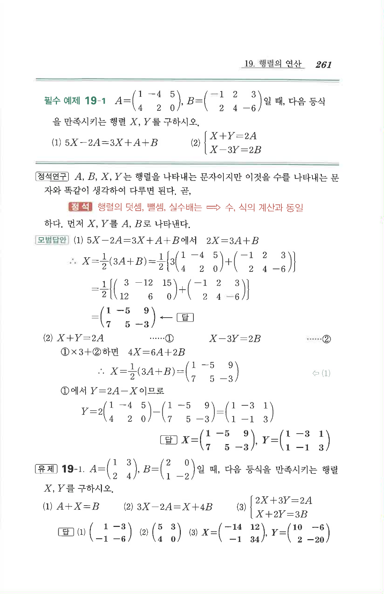

# 유제 19-1

## 문제

$$A=\begin{pmatrix}1&3\\2&4\end{pmatrix},\quad B=\begin{pmatrix}2&0\\1&-2\end{pmatrix}$$
일 때, 다음 식을 만족시키는 행렬 $X,Y$를 구하시오.

1. $A+X=B$
2. $3X-2A=X+4B$
3. $\begin{cases}2X+3Y=2A\\X+2Y=3B\end{cases}$

## 정답

1. $$X=\begin{pmatrix}1&-3\\-1&-6\end{pmatrix}$$
2. $$X=\begin{pmatrix}5&3\\4&0\end{pmatrix}$$
3. $$X=\begin{pmatrix}-14&12\\-1&34\end{pmatrix},\quad Y=\begin{pmatrix}10&-6\\2&-20\end{pmatrix}$$

## 원문

