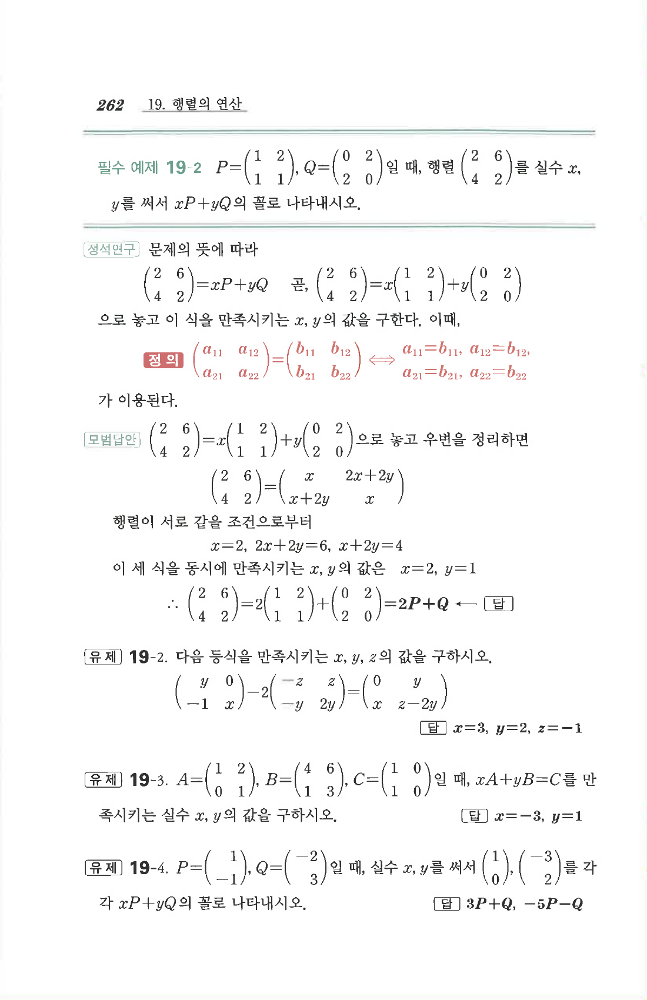

# 유제 19-2

## 문제

다음 등식을 만족시키는 $x,y,z$의 값을 구하시오.

$$\begin{pmatrix}y&0\\-1&x\end{pmatrix}-2\begin{pmatrix}-z&z\\-y&2y\end{pmatrix}=\begin{pmatrix}0&y\\x&z-2y\end{pmatrix}$$

## 정답

$$x=3,\quad y=2,\quad z=-1$$

## 원문

