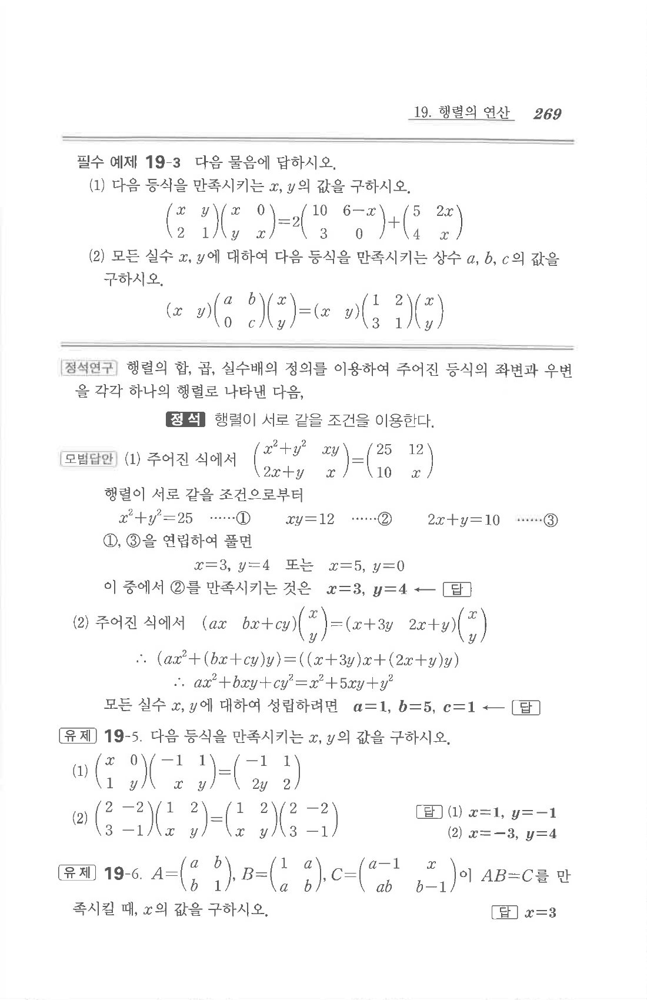

# 유제 19-6

## 문제

$$A=\begin{pmatrix}a&b\\b&1\end{pmatrix},\quad B=\begin{pmatrix}1&a\\a&b\end{pmatrix},\quad C=\begin{pmatrix}a-1&x\\ab&b-1\end{pmatrix}$$
이 $AB=C$를 만족시킬 때, $x$의 값을 구하시오.

## 정답

$$x=3$$

## 원문

