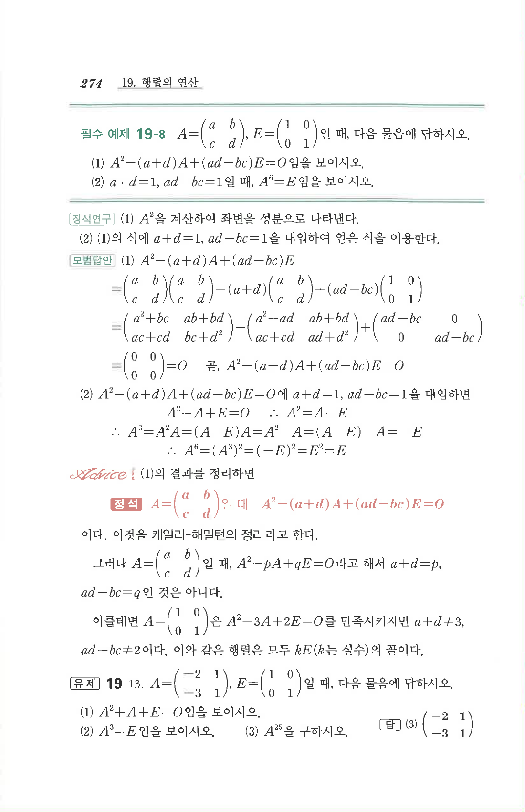

# 유제 19-13

## 문제

$$A=\begin{pmatrix}-2&1\\-3&1\end{pmatrix},\quad E=\begin{pmatrix}1&0\\0&1\end{pmatrix}$$
일 때, 다음 물음에 답하시오.

1. $A^2+A+E=O$임을 보이시오.
2. $A^3=E$임을 보이시오.
3. $A^{25}$을 구하시오.

## 정답

3. $$A^{25}=\begin{pmatrix}-2&1\\-3&1\end{pmatrix}$$

## 원문

