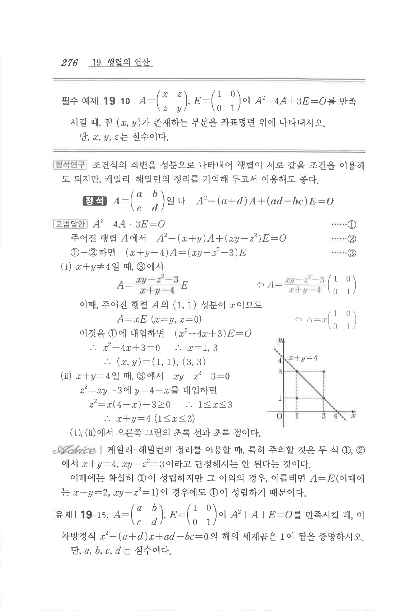

# 유제 19-15

## 문제

$$A=\begin{pmatrix}a&b\\c&d\end{pmatrix},\quad E=\begin{pmatrix}1&0\\0&1\end{pmatrix}$$
이 $A^2+A+E=O$를 만족시킬 때, 이차방정식
$$x^2-(a+d)x+ad-bc=0$$
의 해의 세제곱은 $1$이 됨을 증명하시오. 단, $a,b,c,d$는 실수이다.

## 원문

