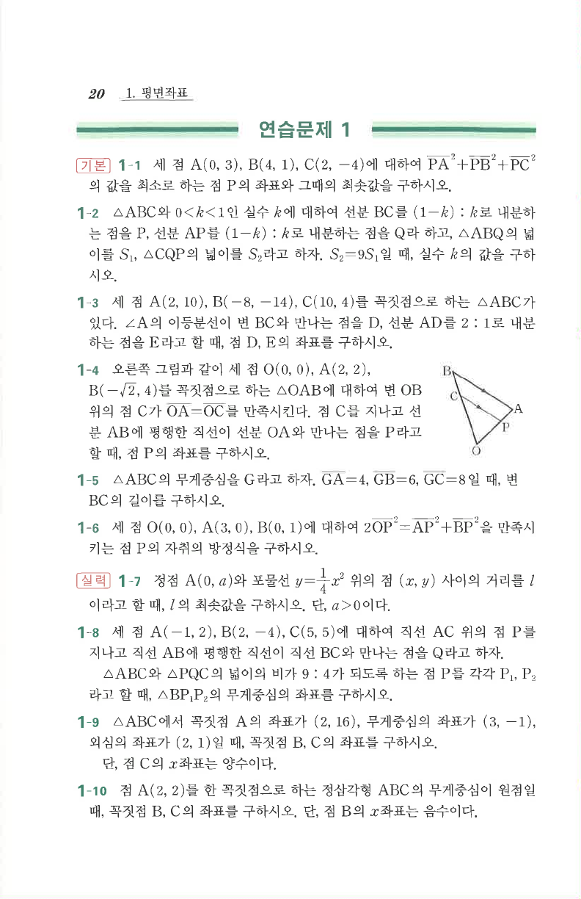

# 연습문제 1-8

## 문제

세 점 $A(-1,2), B(2,-4), C(5,5)$에 대하여 직선 $AC$ 위의 점 $P$를 지나고 직선 $AB$에 평행한 직선이 직선 $BC$와 만나는 점을 $Q$라고 하자. $\triangle ABC$와 $\triangle PQC$의 넓이의 비가 $9:4$가 되도록 하는 점 $P$를 각각 $P_1,P_2$라고 할 때, $\triangle BP_1P_2$의 무게중심의 좌표를 구하시오.

## 원문 문제

## 원문

