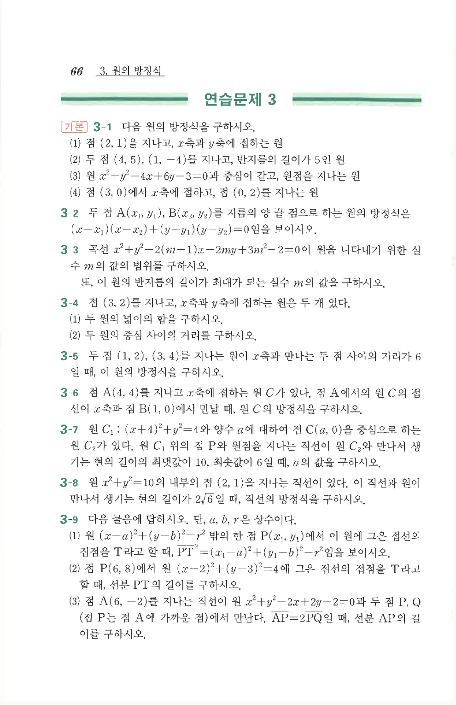

# 연습문제 3-9

## 문제

다음 물음에 답하시오. 단, $a,b,r$은 상수이다.

1. 원 $(x-a)^2+(y-b)^2=r^2$ 밖의 한 점 $P(x_1,y_1)$에서 이 원에 그은 접선의 접점을 $T$라고 할 때,
   $$PT^2=(x_1-a)^2+(y_1-b)^2-r^2$$
   임을 보이시오.
2. 점 $P(6,8)$에서 원 $(x-2)^2+(y-3)^2=4$에 그은 접선의 접점을 $T$라고 할 때, 선분 $PT$의 길이를 구하시오.
3. 점 $A(6,-2)$를 지나는 직선이 원 $x^2+y^2-2x+2y-2=0$과 두 점 $P,Q$에서 만난다. 점 $P$는 점 $A$에 가까운 점이다. $AP=2PQ$일 때, 선분 $AP$의 길이를 구하시오.

## 원문 문제

## 원문

