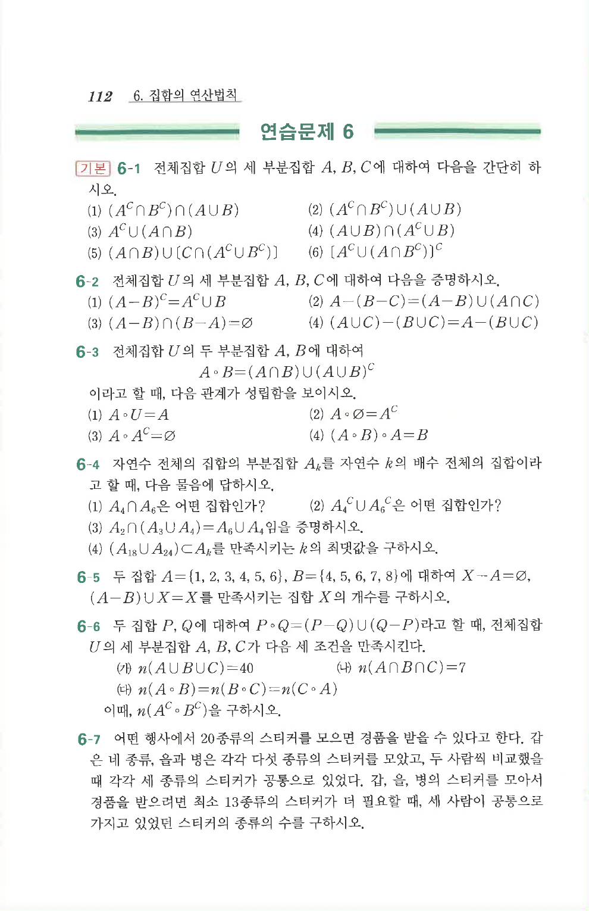

# 연습문제 6-2

## 문제

전체집합 $U$의 세 부분집합 $A$, $B$, $C$에 대하여 다음을 증명하시오.

1. $(A-B)^C=A^C\cup B$
2. $A-(B-C)=(A-B)\cup(A\cap C)$
3. $(A-B)\cap(B-A)=\varnothing$
4. $(A\cup C)-(B\cup C)=A-(B\cup C)$

## 원문 문제

## 원문

