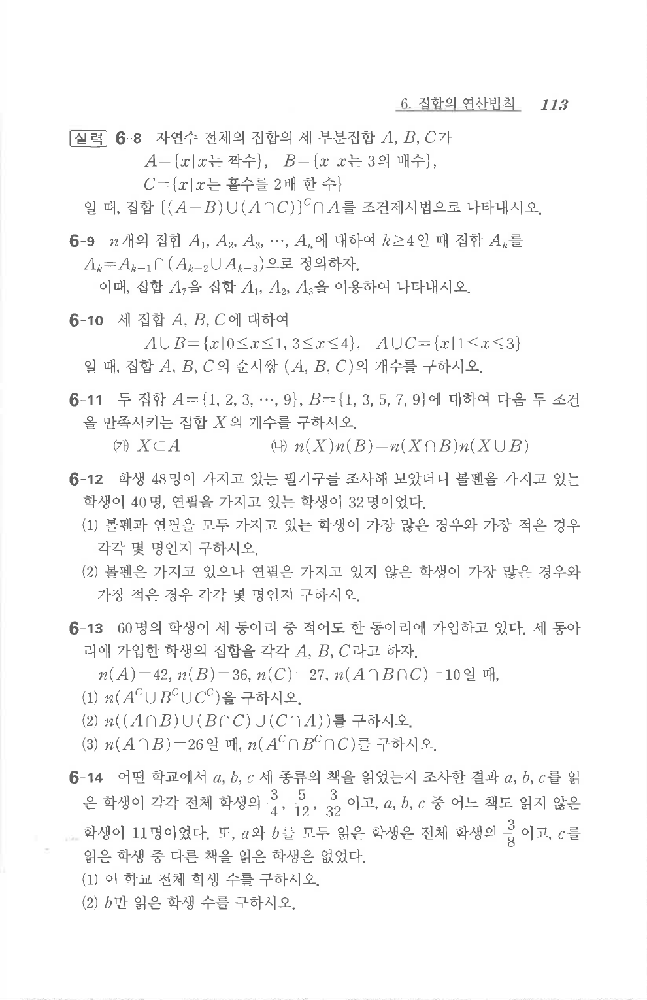

# 연습문제 6-9

## 문제

$n$개의 집합 $A_1$, $A_2$, $A_3$, $\cdots$, $A_n$에 대하여 $k\ge4$일 때 집합 $A_k$를

$$A_k=A_{k-1}\cap(A_{k-2}\cup A_{k-3})$$

으로 정의하자. 이때, 집합 $A_7$을 집합 $A_1$, $A_2$, $A_3$을 이용하여 나타내시오.

## 원문 문제

## 원문

