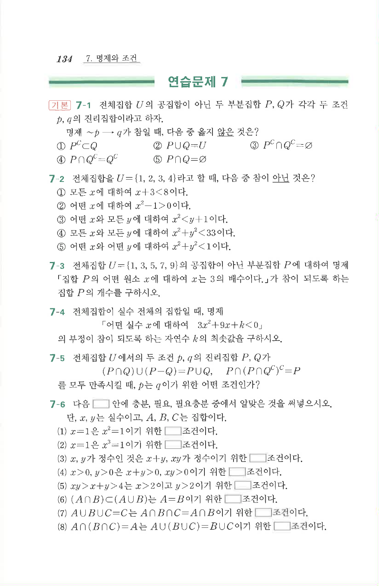

# 연습문제 7-2

## 문제

전체집합을 $U=\{1,2,3,4\}$라고 할 때, 다음 중 참이 아닌 것은?

① 모든 $x$에 대하여 $x+3<8$이다.  
② 어떤 $x$에 대하여 $x^2-1>0$이다.  
③ 어떤 $x$와 모든 $y$에 대하여 $x^2<y+1$이다.  
④ 모든 $x$와 모든 $y$에 대하여 $x^2+y^2<33$이다.  
⑤ 어떤 $x$와 어떤 $y$에 대하여 $x^2+y^2<1$이다.

## 원문 문제

## 원문

