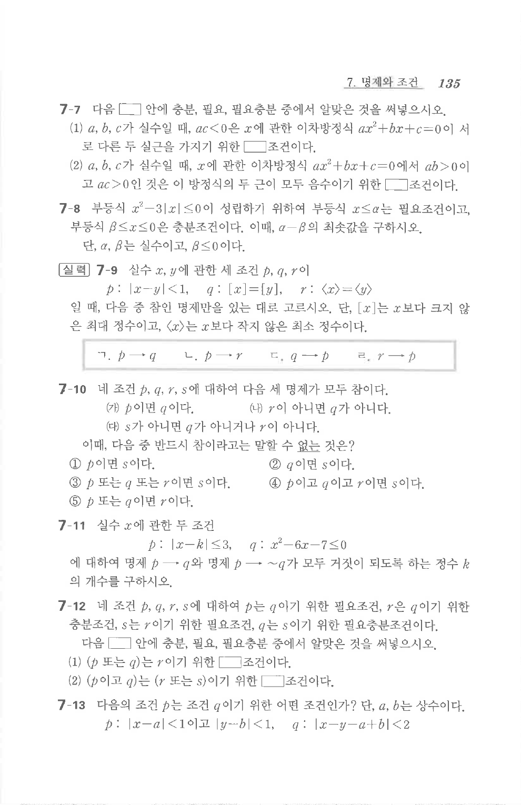

# 연습문제 7-7

## 문제

다음 $\square$ 안에 충분, 필요, 필요충분 중에서 알맞은 것을 써넣으시오.

1. $a$, $b$, $c$가 실수일 때, $ac<0$은 $x$에 관한 이차방정식 $ax^2+bx+c=0$이 서로 다른 두 실근을 가지기 위한 $\square$ 조건이다.
2. $a$, $b$, $c$가 실수일 때, $x$에 관한 이차방정식 $ax^2+bx+c=0$에서 $ab>0$이고 $ac>0$인 것은 이 방정식의 두 근이 모두 음수이기 위한 $\square$ 조건이다.

## 원문 문제

## 원문

