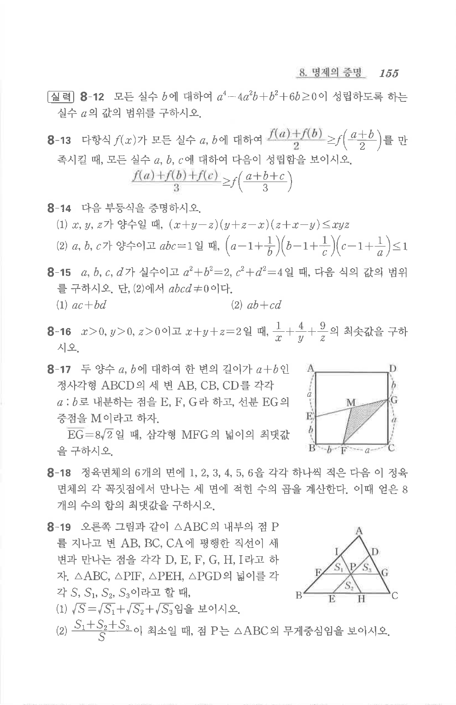

# 연습문제 8-14

## 문제

다음 부등식을 증명하시오.

(1) $x,y,z$가 양수일 때,

$$(x+y-z)(y+z-x)(z+x-y)\le xyz$$

(2) $a,b,c$가 양수이고 $abc=1$일 때,

$$\left(a-1+\frac{1}{b}\right)\left(b-1+\frac{1}{c}\right)\left(c-1+\frac{1}{a}\right)\le 1$$

## 원문 문제

## 원문

