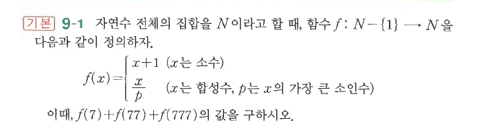

# 연습문제 9-1

## 문제

자연수 전체의 집합을 $N$이라고 할 때, 함수 $f:N-\{1\}\to N$을 다음과 같이 정의하자.

$$f(x)=\begin{cases}x+1 & (x\text{는 소수})\\ \dfrac{x}{p} & (x\text{는 합성수, }p\text{는 }x\text{의 가장 큰 소인수})\end{cases}$$

이때, $f(7)+f(77)+f(777)$의 값을 구하시오.

## 원문

