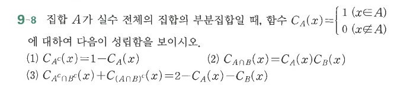

# 연습문제 9-8

## 문제

집합 $A$가 실수 전체의 집합의 부분집합일 때, 함수
$$C_A(x)=\begin{cases}1 & (x\in A)\\0 & (x\notin A)\end{cases}$$
에 대하여 다음이 성립함을 보이시오.

1. $C_{A^c}(x)=1-C_A(x)$
2. $C_{A\cap B}(x)=C_A(x)C_B(x)$
3. $C_{A^c\cap B^c}(x)+C_{(A\cap B)^c}(x)=2-C_A(x)-C_B(x)$

## 원문

