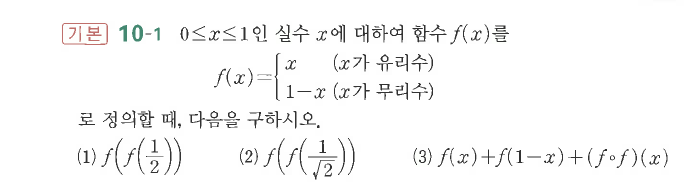

# 연습문제 10-1

## 문제

$0\le x\le1$인 실수 $x$에 대하여 함수 $f(x)$를
$$
f(x)=\begin{cases}
x & (x\text{가 유리수})\\
1-x & (x\text{가 무리수})
\end{cases}
$$
로 정의할 때, 다음을 구하시오.

1. $f\left(f\left(\dfrac12\right)\right)$
2. $f\left(f\left(\dfrac1{\sqrt2}\right)\right)$
3. $f(x)+f(1-x)+(f\circ f)(x)$

## 원문

