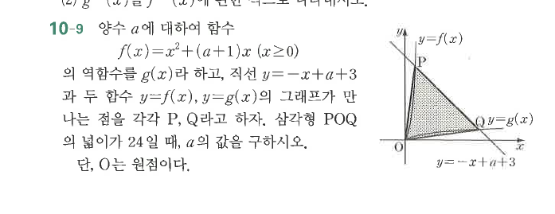

# 연습문제 10-9

## 문제

양수 $a$에 대하여 함수
$$f(x)=x^2+(a+1)x\quad (x\ge0)$$
의 역함수를 $g(x)$라 하고, 직선 $y=-x+a+3$과 두 함수 $y=f(x)$, $y=g(x)$의 그래프가 만나는 점을 각각 $P$, $Q$라고 하자. 삼각형 $POQ$의 넓이가 $24$일 때, $a$의 값을 구하시오. 단, $O$는 원점이다.

## 도형

제1사분면에서 $y=f(x)$는 위로 볼록한 증가 곡선, $y=g(x)$는 그 역함수 그래프이며 두 그래프는 직선 $y=x$에 대하여 대칭이다. 직선 $y=-x+a+3$이 각각의 그래프와 만나는 점이 $P$, $Q$이고, 원점 $O$와 함께 삼각형 $POQ$가 음영 처리되어 있다.

## 원문

