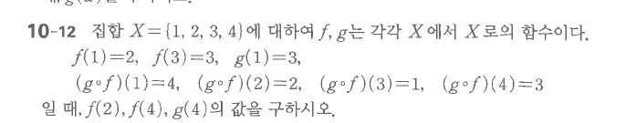

# 연습문제 10-12

## 문제

집합 $X=\{1,2,3,4\}$에 대하여 $f$, $g$는 각각 $X$에서 $X$로의 함수이다.
$$f(1)=2,\qquad f(3)=3,\qquad g(1)=3,$$
$$(g\circ f)(1)=4,\qquad (g\circ f)(2)=2,\qquad (g\circ f)(3)=1,\qquad (g\circ f)(4)=3$$
일 때, $f(2)$, $f(4)$, $g(4)$의 값을 구하시오.

## 원문

