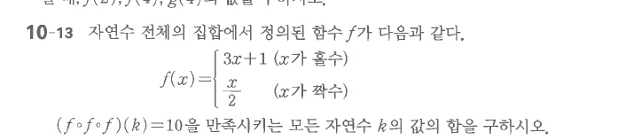

# 연습문제 10-13

## 문제

자연수 전체의 집합에서 정의된 함수 $f$가 다음과 같다.
$$
f(x)=\begin{cases}
3x+1 & (x\text{가 홀수})\\
\dfrac{x}{2} & (x\text{가 짝수})
\end{cases}
$$
$$(f\circ f\circ f)(k)=10$$
을 만족시키는 모든 자연수 $k$의 값의 합을 구하시오.

## 원문

