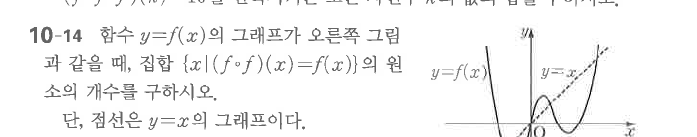

# 연습문제 10-14

## 문제

함수 $y=f(x)$의 그래프가 오른쪽 그림과 같을 때, 집합
$$\{x\mid (f\circ f)(x)=f(x)\}$$
의 원소의 개수를 구하시오. 단, 점선은 $y=x$의 그래프이다.

## 도형

곡선 $y=f(x)$와 점선 $y=x$가 좌표평면에 함께 그려져 있다. $y=f(x)$는 세 번 꺾이는 형태로 $y=x$와 여러 번 만나며, $(f\circ f)(x)=f(x)$ 조건을 그래프의 고정점 관계로 해석하는 문제이다.

## 원문

