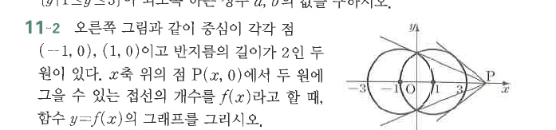

# 연습문제 11-2

## 문제

오른쪽 그림과 같이 중심이 각각 점 $(-1,0)$, $(1,0)$이고 반지름의 길이가 $2$인 두 원이 있다. $x$축 위의 점 $P(x,0)$에서 두 원에 그을 수 있는 접선의 개수를 $f(x)$라고 할 때, 함수 $y=f(x)$의 그래프를 그리시오.

## 도형

두 원은 $x$축 위의 중심 $(-1,0)$, $(1,0)$을 가지고 서로 겹친다. 점 $P(x,0)$의 위치에 따라 각 원에 그을 수 있는 접선의 개수가 달라진다.

## 원문

