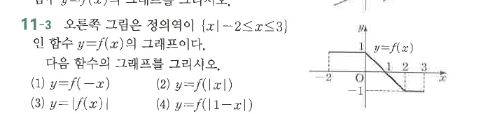

# 연습문제 11-3

## 문제

오른쪽 그림은 정의역이 $\{x\mid -2\le x\le3\}$인 함수 $y=f(x)$의 그래프이다. 다음 함수의 그래프를 그리시오.

1. $y=f(-x)$
2. $y=f(|x|)$
3. $y=|f(x)|$
4. $y=f(|1-x|)$

## 도형

원래 그래프는 $[-2,0]$에서 $y=1$인 수평선, $[0,2]$에서 $1$에서 $-1$로 내려가는 선분, $[2,3]$에서 $y=-1$인 수평선으로 이루어진다.

## 원문

