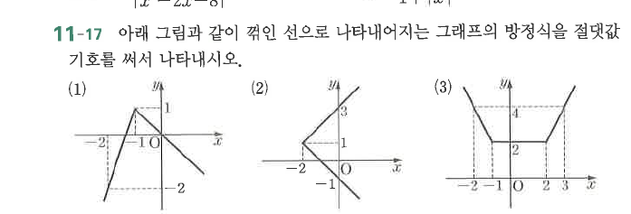

# 연습문제 11-17

## 문제

아래 그림과 같이 꺾인 선으로 나타내어지는 그래프의 방정식을 절댓값 기호를 써서 나타내시오.

## 도형

(1)은 왼쪽에서 급하게 증가해 $(-1,1)$에서 꺾인 뒤 오른쪽으로 감소하는 그래프이다. (2)는 꼭짓점이 $(-2,1)$인 오른쪽으로 열린 V자형 그래프이고, (3)은 가운데가 $y=2$인 수평선이며 양쪽에서 위로 올라가는 대칭 그래프이다.

## 원문

