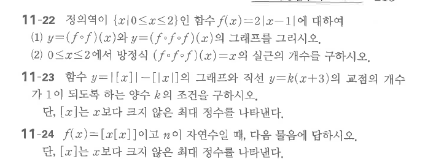

# 연습문제 11-22

## 문제

정의역이 $\{x\mid0\le x\le2\}$인 함수 $f(x)=2|x-1|$에 대하여 다음 물음에 답하시오.

1. $y=(f\circ f)(x)$와 $y=(f\circ f\circ f)(x)$의 그래프를 그리시오.
2. $0\le x\le2$에서 방정식 $(f\circ f\circ f)(x)=x$의 실근의 개수를 구하시오.

## 원문

