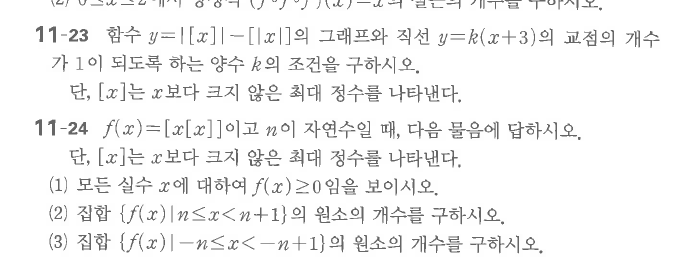

# 연습문제 11-23

## 문제

함수
$$y=|[x]|-[|x|]$$
의 그래프와 직선 $y=k(x+3)$의 교점의 개수가 $1$이 되도록 하는 양수 $k$의 조건을 구하시오. 단, $[x]$는 $x$보다 크지 않은 최대 정수를 나타낸다.

## 도형

바닥함수 $[x]$와 $[|x|]$가 포함된 계단형 그래프와 원점을 지나지 않는 직선 $y=k(x+3)$의 교점 개수를 따지는 문제이다.

## 원문

